<div align="center">


# ✦　ＬＡ　ＮＵＢＥ　ＢＯＴ　☁️
### An intelligent Zoom meeting management Telegram bot

[](LICENSE)
[](https://nodejs.org/)
[](https://github.com/PupFr/Nebulosa/stargazers)
[](https://github.com/PupFr/Nebulosa/network)
[](https://github.com/PupFr/Nebulosa/actions)
[](https://railway.app)

**Revolutionizing virtual collaboration through advanced AI-powered features and seamless communication technologies.**

</div>

---

## 📋 Table of Contents

- [🚀 Features](#-features)
  - [Core Functionality](#core-functionality)
  - [Advanced Capabilities](#advanced-capabilities)
- [🏗️ Architecture](#️-architecture)
  - [Backend](#backend)
  - [Frontend](#frontend)
  - [External Services](#external-services)
- [⚡ Quick Start](#-quick-start)
  - [Prerequisites](#prerequisites)
  - [Environment Variables](#environment-variables)
  - [Installation](#installation)
  - [OAuth Setup](#oauth-setup)
- [🤖 Commands](#-commands)
  - [User Commands](#user-commands)
  - [Meeting Management](#meeting-management)
  - [Browser Bot Automation (Admin)](#browser-bot-automation-admin)
  - [Admin Commands](#admin-commands)
- [💻 Development](#-development)
  - [Project Structure](#project-structure)
  - [Key Features Implementation](#key-features-implementation)
- [🚀 Deployment](#-deployment)
- [🤝 Contributing](#-contributing)
- [📄 License](#-license)
- [📞 Support](#-support)
- [⭐ Call to Action](#-call-to-action)

---

## 🚀 Features

### 🔧 Core Functionality

<table>
<tr>
<td width="50%">

**🤖 Automated Multipin with Puppeteer**
- Browser automation for seamless multipin control
- Real-time participant management

**🎯 Multipin Management**
- Camera ON + Hand Raise required for access
- Smart permission granting system

**📊 Real-time Meeting Monitoring**
- Continuous participant scanning
- 30-second interval monitoring

</td>
<td width="50%">

**🚨 Automatic Violation Detection**
- Escalating enforcement actions
- Smart policy violation tracking

**🌐 Bilingual Support**
- Complete English/Spanish localization
- Mexico flag integration

**⚡ Advanced Processing**
- Lightning-fast response times
- Intelligent automation workflows

</td>
</tr>
</table>

### 🚀 Advanced Capabilities

<table>
<tr>
<td width="50%">

**🌐 Browser Bot Automation**
- Headless Puppeteer integration
- Actual multipin execution automation
- Auto-start with new meetings

**💬 Meeting Host Chat**
- Private coordination within Zoom meetings
- Host/cohost communication tools

**🔔 Command Chat Integration**
- Strategic alerts and notifications
- Real-time violation reporting

</td>
<td width="50%">

**🛡️ Zoom Chat Monitoring**
- Automatic spam detection
- Smart link removal system

**🔐 GitHub OAuth Bypass**
- Static domain solution
- Seamless authentication flow

**📊 Professional Dashboard**
- Real-time analytics interface
- Comprehensive monitoring tools

</td>
</tr>
</table>

## 🏗️ Architecture

```mermaid
graph TB
    A[🤖 Telegram Bot] --> B[⚡ Express Server]
    B --> C[🗄️ PostgreSQL + Drizzle ORM]
    B --> D[🌐 React Dashboard]
    A --> E[📹 Zoom API]
    A --> F[🔗 GitHub Pages OAuth]
    E --> G[🤖 Puppeteer Browser Bot]
    F --> H[🔀 Short.io Redirects]
    
    style A fill:#2ecc71
    style B fill:#3498db
    style C fill:#9b59b6
    style D fill:#e74c3c
    style E fill:#f39c12
    style F fill:#1abc9c
    style G fill:#34495e
    style H fill:#95a5a6
```

<div align="center">



</div>

### 🔙 Backend

| Component | Technology | Purpose |
|-----------|------------|---------|
| **API Server** | Node.js + Express | RESTful API with TypeScript |
| **Bot Engine** | Telegram Bot API | Complete command processing and user interaction |
| **Authentication** | Zoom OAuth Integration | User-level auth with automatic token refresh |
| **Database** | PostgreSQL + Drizzle ORM | Type-safe database operations |

### 🎨 Frontend

| Component | Technology | Purpose |
|-----------|------------|---------|
| **UI Framework** | React + TypeScript | Modern dashboard interface |
| **Design System** | Shadcn/UI + Tailwind | Professional component library |
| **State Management** | TanStack Query | Server state management |
| **Real-time Updates** | WebSocket/SSE | Live meeting insights and bot status |

### 🔌 External Services

| Service | Purpose | Implementation |
|---------|---------|----------------|
| **Zoom API** | Meeting management and participant monitoring | REST API integration |
| **GitHub Pages** | OAuth callback hosting | Bypasses dynamic domain issues |
| **Short.io** | Domain redirect management | URL shortening and analytics |

---

## 📸 Visual Overview

<div align="center">

### 🎯 Key Features Visualization

```
┌─────────────────┐    ┌─────────────────┐    ┌─────────────────┐
│   🤖 Telegram   │◄──►│  ⚡ Express API  │◄──►│  📹 Zoom API    │
│      Bot        │    │     Server      │    │   Integration   │
└─────────────────┘    └─────────────────┘    └─────────────────┘
         │                       │                       │
         ▼                       ▼                       ▼
┌─────────────────┐    ┌─────────────────┐    ┌─────────────────┐
│  👥 User Commands│    │  🗄️ PostgreSQL  │    │  🤖 Puppeteer   │
│   & Interactions │    │    Database     │    │  Browser Bot    │
└─────────────────┘    └─────────────────┘    └─────────────────┘
```

### 🖼️ Screenshots Coming Soon!

*We're working on adding comprehensive screenshots of the bot interface, dashboard, and key features. Stay tuned for visual documentation updates!*

</div>

## ⚡ Quick Start

### 📋 Prerequisites

| Requirement | Version | Description |
|-------------|---------|-------------|
| **Node.js** | 18+ | JavaScript runtime |
| **PostgreSQL** | Latest | Database (Neon recommended) |
| **Telegram Bot Token** | - | From @BotFather |
| **Zoom OAuth App** | User-level | For API access |

### 🔧 Environment Variables

Create a `.env` file with the following configuration:

```bash
# Telegram Configuration
BOT_TOKEN=your_telegram_bot_token
LOG_CHANNEL_ID=your_telegram_channel_id
ADMIN_USER_ID=your_telegram_user_id

# Zoom API Configuration
ZOOM_USER_CLIENT_ID=your_zoom_client_id
ZOOM_USER_CLIENT_SECRET=your_zoom_client_secret
ZOOM_REDIRECT_URI=your_redirect_uri

# OAuth & Database
GITHUB_OAUTH_CALLBACK=https://your-username.github.io/your-repo/
DATABASE_URL=your_postgresql_url
```

### 🚀 Installation

```bash
# Clone the repository
git clone https://github.com/PupFr/Nebulosa.git
cd Nebulosa

# Install dependencies
npm install

# Start development server
npm run dev
```

### 🔐 OAuth Setup

| Step | Action | Description |
|------|--------|-------------|
| 1️⃣ | **Create GitHub Repository** | For OAuth callback hosting |
| 2️⃣ | **Upload Callback File** | Upload `github-oauth-callback.html` as `index.html` |
| 3️⃣ | **Enable GitHub Pages** | Configure in repository settings |
| 4️⃣ | **Update Zoom App** | Set OAuth Redirect URL to GitHub Pages URL |

## 🤖 Commands

### 👤 User Commands

| Command | Description | Usage |
|---------|-------------|-------|
| `/start` | Welcome message and bot introduction | `/start` |
| `/help` | Command list and usage instructions | `/help` |
| `/lang` | Switch between English/Spanish | `/lang` |
| `/zoomlogin` | Zoom OAuth authentication | `/zoomlogin` |

### 📹 Meeting Management

| Command | Description | Usage |
|---------|-------------|-------|
| `/createroom [topic]` | Create instant meeting with auto-multipin | `/createroom Weekly Standup` |
| `/scanroom [meeting_id]` | Scan meeting participants | `/scanroom 123456789` |
| `/monitor [meeting_id]` | Start/stop automatic monitoring | `/monitor 123456789` |
| `/chatwatch [meeting_id]` | Monitor and moderate Zoom chat | `/chatwatch 123456789` |

### 🤖 Browser Bot Automation (Admin)

| Command | Description | Usage |
|---------|-------------|-------|
| `/startbot [meeting_id] [zoom_link]` | Start browser bot for multipin automation | `/startbot 123456789 https://zoom.us/j/...` |
| `/stopbot [meeting_id]` | Stop browser bot automation | `/stopbot 123456789` |
| `/botstatus` | View all active browser bots status | `/botstatus` |

### 🔧 Admin Commands

| Command | Description | Usage |
|---------|-------------|-------|
| `/startsession` | Start monitoring session (test mode) | `/startsession` |
| `/status` | Bot system status with browser bot info | `/status` |
| `/shutdown` | End monitoring session and cleanup browser bots | `/shutdown` |
| `/promote [meeting_id] [username]` | Promote user to cohost | `/promote 123456789 @username` |
| `/commandchat` | Manage Command Chat integration | `/commandchat` |

## 💻 Development

### 📁 Project Structure

```
📦 Nebulosa
├── 🤖 bot.cjs                 # Main Telegram bot logic
├── 🖥️ server/
│   ├── 📄 index.ts           # Express server
│   ├── 🛣️ routes.ts          # API endpoints
│   ├── 💾 storage.ts         # Database interface
│   └── ⚡ vite.ts            # Development server
├── 🎨 client/
│   ├── 📂 src/
│   │   ├── 🧩 components/    # React components
│   │   ├── 📄 pages/         # Route pages
│   │   └── 🔧 lib/           # Utilities
│   └── 🌐 index.html         # Frontend entry
├── 🔗 shared/
│   └── 📊 schema.ts          # Database schema
└── 🔐 zoomAuth.js            # Zoom API integration
```

### 🔑 Key Features Implementation

#### 🎯 Multipin Core System
<table>
<tr>
<td width="50%">

**⏱️ Timer Management**
- 60-second camera-off timer
- Automatic access expiration
- Smart timer reset on compliance

</td>
<td width="50%">

**✋ Permission Control**
- Instant regrant on camera + hand raise
- Hand raise prevents accidental grants
- Real-time compliance monitoring

</td>
</tr>
</table>

#### 🔐 OAuth Bypass Solution
<table>
<tr>
<td width="50%">

**🏠 GitHub Pages Integration**
- Static callback page hosting
- Reliable domain management
- No dynamic domain issues

</td>
<td width="50%">

**🔄 Smart Redirects**
- Automatic parameter forwarding
- Zoom OAuth compatibility
- Seamless user experience

</td>
</tr>
</table>

#### 📊 Meeting Analytics
<table>
<tr>
<td width="50%">

**👥 Participant Tracking**
- Real-time participant monitoring
- Join/leave event detection
- Attendance analytics

</td>
<td width="50%">

**🚨 Violation Management**
- Automated violation detection
- Progressive enforcement actions
- Detailed reporting system

</td>
</tr>
</table>

## 🚀 Deployment

### 🚂 Railway Deployment

| Step | Action | Command/Notes |
|------|--------|---------------|
| 1️⃣ | **Import Repository** | Connect GitHub repo to Railway |
| 2️⃣ | **Configure Environment** | Set all required environment variables |
| 3️⃣ | **Deploy Application** | `npm run dev` |
| 4️⃣ | **Access Dashboard** | Use provided Railway URL |

### ☁️ Production Considerations

<table>
<tr>
<td width="50%">

**🗄️ Database Management**
- Set up proper database migrations
- Configure connection pooling
- Implement backup strategies

**📊 Monitoring & Logging**
- Configure comprehensive logging
- Set up application monitoring
- Implement error tracking

</td>
<td width="50%">

**🔒 Security & Performance**
- Implement rate limiting
- Configure security headers
- Set up SSL certificates

**🔧 Infrastructure**
- Container orchestration
- Load balancing setup
- CDN configuration

</td>
</tr>
</table>

### 🌐 Supported Platforms

| Platform | Status | Features |
|----------|--------|----------|
| **Railway** | ✅ Fully Supported | One-click deployment, auto-scaling |
| **Vercel** | ✅ Supported | Frontend deployment, serverless functions |
| **Replit** | ✅ Supported | Development environment, instant deploy |
| **Docker** | ✅ Supported | Containerized deployment |

## 🤝 Contributing

We welcome contributions from the community! Here's how you can help:

### 🛠️ Development Process

| Step | Action | Description |
|------|--------|-------------|
| 1️⃣ | **Fork Repository** | Create your own copy of the project |
| 2️⃣ | **Create Feature Branch** | `git checkout -b feature/amazing-feature` |
| 3️⃣ | **Implement Changes** | Add your improvements with tests |
| 4️⃣ | **Submit Pull Request** | Describe your changes clearly |

### 📝 Contribution Guidelines

- **Code Style**: Follow existing patterns and ESLint rules
- **Testing**: Add tests for new features
- **Documentation**: Update docs for any API changes
- **Commit Messages**: Use conventional commit format

## 📄 License

This project is licensed under the **MIT License** - see the [LICENSE](LICENSE) file for details.

### 📋 License Summary
- ✅ Commercial use
- ✅ Modification
- ✅ Distribution
- ✅ Private use
- ❌ Liability
- ❌ Warranty

## 📞 Support

Need help? We're here for you!

### 🆘 Getting Help

| Method | Response Time | Best For |
|--------|---------------|----------|
| **GitHub Issues** | 24-48 hours | Bug reports, feature requests |
| **Documentation** | Instant | Setup guides, API reference |
| **Community Forum** | Community-driven | General questions, discussions |

### 🐛 Reporting Issues

When reporting issues, please include:
- **Environment details** (Node.js version, OS, etc.)
- **Steps to reproduce** the problem
- **Expected vs actual behavior**
- **Error messages** or logs

---

## ⭐ Call to Action

<div align="center">

### 🌟 Love this project? Here's how you can show your support:

[](https://github.com/PupFr/Nebulosa/stargazers)
[](https://github.com/PupFr/Nebulosa/network)
[](https://github.com/PupFr)

### 🚀 Ready to contribute?

1. **⭐ Star** this repository to show your support
2. **🍴 Fork** the project to start contributing
3. **📝 Create** an issue to discuss new features
4. **🔧 Submit** a pull request with your improvements

### 💫 Join our growing community!

**Together, we're revolutionizing virtual collaboration!**

</div>

---

<div align="center">

**LA NUBE BOT** ✦ *Revolutionizing virtual collaboration through intelligent automation* ✦


</div>